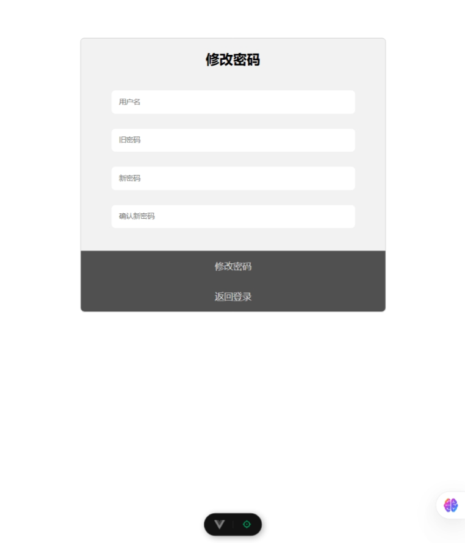

# 大作业任务概述

设计并实现一个Web应用系统，该系统采用前后端分离的方式实现，其中前端框架建议采用ElementUI+Vue.js来实现，也可以采用React等其他框架，后端框架建议采用SpringBoot+Mybatis或者Spring+SpringMVC+Mybatis框架实现。

Web系统包括下列基本功能：
1. 登录用户操作
    1. 注册
    1. 登录主页展示
    1. 修改密码和注销
1. 联系人管理
    1. 列表和查询
    1. 增删改操作
1. 文章管理
    1. 统计和图表
    1. 文章增删改

# 系统分析与设计

总体采用前后端分离设计，前端以Vue.js为主体，后端以SpringBoot+MySQL为主体，采用HTTP协议通信。

## 前端总体设计

前端使用Vue.js开发，涉及JS、HTML、CSS、ElementPlus、Pinia、Vue Router，以各个页面（对应项目中的view）为单位划分边界进行开发。每个页面根据显示宽度可以有两种界面形式。登录前的页面在小于等于800px和大于800px两种宽度下有不同的显示形式，登录后的页面侧边栏在小于1000px时隐藏左侧边栏。登录后可以切换主题。

本系统的前端项目包括以下界面：
1. 用户注册界面
1. 用户登录界面
1. 密码修改界面
1. 用户个人信息界面
1. 日历界面
1. 联系人管理界面
1. 文章管理界面组
    1. 统计数据与图表界面
    1. 单个作者的文章管理界面

界面间跳转关系如下图所示：


## 前端详细设计

用户注册界面
1. UI简图


1. 功能
    - 用户注册
1. 接口
    - POST /users
    - POST /images

用户登录界面
1. UI简图


1. 功能
    - 用户登录
1. 接口
    - POST /auth/login

密码修改界面
1. UI简图


1. 功能
    - 修改密码
1. 接口
    - PUT /users

用户个人信息界面
1. UI简图

1. 功能
    - 显示用户个人基本信息
1. 接口
    - GET /users Authorization
    - GET /images/{avatarId}

日历界面
1. UI简图

1. 功能
    - 显示日历和用户头像
1. 接口
    - GET /images/{avatarId}

联系人管理界面
1. UI简图


1. 功能
    - 显示联系人列表
    - 增删改联系人
1. 接口
    - GET /contacts
    - POST /contacts
    - PUT /contacts/{name}
    - DELETE /contacts/{name}

文章管理界面组
1. UI简图


1. 功能
    - 以统计数据和图表形式显示各个作者的文章数量
    - 显示单个作者的文章列表
    - 增删改指定作者的文章
1. 接口
    - GET /users/{username}
    - GET /articles
    - GET /articles/{author}
    - POST /articles
    - PUT /articles/{articleId}
    - DELETE /articles/{articleId}

## 后端总体设计

后端使用SpringBoot开发，借助了MyBatis、Lombok、Spring Security、Tika、JsonWebToken。

整体结构如下图所示，大致层次分成Controller、Service、Mapper，Controller接收HTTP请求，调用service处理，处理完后返回结果。Service在涉及数据库的时候调用Mapper进行数据库操作。各层之间会使用dto和model进行数据交换，同时Securtiy提供上下文和用户身份验证。


## 后端详细设计

### 功能类
Controller
- AuthController
    - 依赖
        - AuthService
    - 方法
        - public ResponseEntity<LoginResponse> login(LoginRequest request)
    - 接口
        - POST /auth/login
- UserController
    - 依赖
        - UserService
    - 方法
        - public ResponseEntity<Void> register(RegistryRequest request)
        - public ResponseEntity<UserInfo> getUserInfo()
        - public ResponseEntity<UserInfo> getUserInfo(String username)
        - public ResponseEntity<Void> updateUserInfo(PwdUpdateRequest request)
    - 接口
        - POST /users
        - GET /users
        - GET /users/{username}
        - PUT /users
- ImgController
    - 依赖
        - ImgService
    - 方法
        - public ResponseEntity<ImgUploadResponse> uploadImg(MultipartFile file)
        - public ResponseEntity<Resource> getImg(String avatarId)
    - 接口
        - POST /images
        - GET /images/{avatarId}
- ContactController
    - 依赖
        - ContactService
    - 方法
        - public ResponseEntity<List<Contact>> getContacts()
        - public ResponseEntity<Void> addContact(ContactForm form)
        - public ResponseEntity<Void> deleteContact(String name)
        - public ResponseEntity<Void> updateContact(String name, ContactForm form)
    - 接口
        - GET /contacts
        - POST /contacts
        - DELETE /contacts/{name}
        - PUT /contacts/{name}
- ArticleController
    - 依赖
        - ArticleService
    - 方法
        - public List<ArticleCount> getArticleCounts()
        - public List<Article> getArticlesByAuthor(String author)
        - public ResponseEntity<Void> addArticle(ArticleForm form)
        - public ResponseEntity<Void> updateArticle(Integer articleId, ArticleForm form)
        - public ResponseEntity<Void> deleteArticle(Integer articleId)
    - 接口
        - GET /articles
        - GET /articles/{author}
        - POST /articles
        - PUT /articles/{articleId}
        - DELETE /articles/{articleId}

Service
- AuthServiceImpl
    - 依赖
        - UserMapper
    - 方法
        - String login(String username, String password)
- UserServiceImpl
    - 依赖
        - UserMapper
    - 方法
        - public void createUser(User user)
        - public User findUserByUsername(String username)
        - public Boolean updatePassword(PwdUpdateRequest request)
- ImgServiceImpl
    - 依赖
        - 无
    - 方法
        - public URI save(MultipartFile file)
        - public String getFileMd5(MultipartFile file)
- ContactServiceImpl
    - 依赖
        - ContactMapper
    - 方法
        - public List<Contact> findByUsername(String username)
        - public void addContact(Contact contact)
        - public void deleteContact(ContactId contactId)
        - public void updateContact(String name, Contact contact)
- ArticleServiceImpl
    - 依赖
        - ArticleMapper
        - UserMapper
    - 方法
        - public List<ArticleCount> getArticleCounts()
        - public List<Article> getArticlesByAuthor(String author)
        - public void addArticle(ArticleForm form)
        - public void deleteArticle(Integer articleId)
        - public void updateArticle(Integer articleId, ArticleForm form)

Security
- SecurityConfig
    - 方法
        - public SecurityFilterChain securityFilterChain(HttpSecurity http)

### 数据库访问
- UserMapper
    - @Select("SELECT * FROM users WHERE username = #{username}")
      findByUsername(String username)  
      功能描述：根据用户名查询用户信息。

    - @Insert("Insert into users(username, password, email, balance, birthday, avatar_id) values(#{username}, #{password}, #{email}, #{balance}, #{birthday}, #{avatarId})")
      insert(User user)  
      功能描述：插入新的用户信息到数据库。

    - @Update("UPDATE users SET password = #{newPassword} WHERE username = #{username}")
      updatePassword(PwdUpdateRequest request)  
      功能描述：根据用户名更新用户密码。

    - @Select("SELECT username FROM users")
      getAllUsernames()  
      功能描述：获取所有用户的用户名列表。

- ContactMapper
    - @Select("SELECT * FROM contacts WHERE username = #{username}")
      findByUsername(String username)  
      功能描述：根据用户名查询用户的联系人信息。

    - @Insert("INSERT INTO contacts (username, name, province, city, address, postal_code, date) VALUES (#{username}, #{name}, #{province}, #{city}, #{address}, #{postalCode}, #{date})")
      insert(Contact contact)  
      功能描述：插入新的联系人信息。

    - @Delete("DELETE FROM contacts WHERE username = #{username} AND name = #{name}")
      delete(ContactId contactId)  
      功能描述：根据用户名和联系人姓名删除指定的联系人。

    - @Update("UPDATE contacts SET name = #{contact.name}, province = #{contact.province}, city = #{contact.city}, address = #{contact.address}, postal_code = #{contact.postalCode}, date = #{contact.date} WHERE username = #{contact.username} AND name = #{name}")
      update(@Param("name") String name, @Param("contact") Contact contact)  
      功能描述：根据用户名和联系人姓名更新联系人信息。

- ArticleMapper
    - @Select("SELECT COUNT(*) FROM articles WHERE author = #{username}")
      countArticleByUsername(String username)  
      功能描述：根据作者用户名查询该作者发布的文章数量。

    - @Select("SELECT * FROM articles WHERE author = #{author}")
      getArticlesByAuthor(String author)  
      功能描述：根据作者获取该作者的所有文章。

    - @Insert("INSERT INTO articles (author, title, content) VALUES (#{author}, #{title}, #{content})")
      insert(ArticleForm form)  
      功能描述：插入新的文章。

    - @Delete("DELETE FROM articles WHERE article_id = #{articleId}")
      delete(Integer articleId)  
      功能描述：根据文章 ID 删除指定的文章。

    - @Update("UPDATE articles SET author = #{form.author}, title = #{form.title}, content = #{form.content} WHERE article_id = #{articleId}")
      update(@Param("articleId") Integer articleId, @Param("form") ArticleForm form)  
      功能描述：更新指定文章的信息。

## 接口设计

注册
POST /users

- 请求
```
{
    username: string,
    password: string,
    email: string,
    birthday: string,
    avatar: string,
}
```

- 响应
    - 成功
    ```
    200 Ok
    ```
    - 失败
    ```
    400 Bad Request
    ```

上传图片
POST /images

- 请求
```
二进制
```

- 响应
    - 成功
    ```
    200 Ok
    ```

登录
POST /auth/login

- 请求
```
{
    username: string,
    password: string,
}
```

- 响应json
    - 成功
    ```
    {
        token: string,
    }
    ```
    - 失败
    ```
    401 Unauthorized
    ```

修改密码
PUT /users

- 请求
```
{
    username: string,
    password: string,
    newPassword: string,
}
```

- 响应
    - 成功
    ```
    200 Ok
    ```
    - 失败
    ```
    401 Unauthorized
    ```

获取用户个人信息
GET /users

- 响应
    - 成功
    ```
    {
        username: string,
        email: string,
        balance: number,
        birthday: date,
        avatarId: string,
    }


获取图片
GET /images/{avatarId}

- 响应
    - 成功
    ```
    Content-Type: image/jpeg等图片格式
    二进制
    ```

获取联系人
GET /contacts

- 响应
    - 成功
    ```
    [
        {
            name: string,
            province: string,
            city: string,
            address: string,
            postalCode: string,
            date: string,
        },
    ]
    ```

新增联系人
POST /contacts

- 请求
```
{
    name: string,
    province: string,
    city: string,
    address: string,
    postalCode: string,
    date: string,
}
```

- 响应
    - 成功
    ```
    200 Ok
    ```
    - 失败
    ```
    400 Bad Request
    ```

修改联系人
PUT /contacts/{name}

- 请求
```
{
    name: string,
    province: string,
    city: string,
    address: string,
    postalCode: string,
    date: string,
}
```

- 响应
    - 成功
    ```
    200 Ok
    ```

删除联系人
DELETE /contacts/{name}

- 响应
    - 成功
    ```
    200 Ok
    ```

获取用户信息
GET /users/{username}

- 响应
    - 成功
    ```
    {
        username: string,
        email: string,
        balance: number,
        birthday: date,
        avatarId: string,
    }
    ```

获取文章计数
GET /articles

- 响应
    - 成功
    ```
    [
        {
            author: string,
            count: number,
        },
    ]
    ```

获取作者文章列表
GET /articles/{author}

- 响应
    - 成功
    ```
    [
        {
            articleId: string,
            author: string,
            title: string,
            content: string,
        },
    ]
    ```

新增文章
POST /articles

- 请求
    ```
    {
        author: string,
        title: string,
        content: string,
    }
    ```

- 响应
    - 成功
    ```
    200 Ok
    ```

修改文章
PUT /articles/{articleId}

- 请求
    ```
    {
        author: string,
        title: string,
        content: string,
    }
    ```

- 响应
    - 成功
    ```
    200 Ok
    ```

删除文章
DELETE /articles/{articleId}

- 响应
    - 成功
    ```
    200 Ok
    ```

## 数据库设计

### 数据字典
users表：用于存储用户的基本信息。
- `user_id` (int, primary key, auto_increment): 用户ID，主键，自增。
- `username` (varchar(50), unique): 用户名，唯一。
- `password` (varchar(255)): 用户密码。
- `email` (varchar(100)): 用户电子邮箱。
- `balance` (decimal(15,2)): 用户余额，精确到小数点后两位。
- `birthday` (date): 用户生日。
- `avatar_id` (varchar(50)): 用户头像ID。

contacts表：用于存储用户的收货地址信息。
- `contact_id` (int, primary key, auto_increment): 收货地址ID，主键，自增。
- `username` (varchar(50)): 用户名。
- `name` (varchar(100)): 收货人姓名。
- `province` (varchar(50)): 省份。
- `city` (varchar(50)): 城市。
- `address` (varchar(255)): 详细地址。
- `postal_code` (varchar(10)): 邮政编码。
- `date` (date): 地址创建日期。

articles表：用于存储文章信息。
- `article_id` (int, primary key, auto_increment): 文章ID，主键，自增。
- `author` (varchar(50)): 作者。
- `title` (varchar(255)): 文章标题。
- `content` (text): 文章内容。


### 建库语句
```SQL
-- 创建数据库
CREATE DATABASE IF NOT EXISTS database_web_dev CHARACTER SET utf8mb4 COLLATE utf8mb4_unicode_ci;

-- 选择数据库
USE database_web_dev;

-- 创建 users 表
CREATE TABLE users (
    username VARCHAR(50) PRIMARY KEY,          -- 用户名作为主键
    password VARCHAR(255) NOT NULL,            -- 密码（建议使用哈希加密存储）
    email VARCHAR(100) UNIQUE NOT NULL,        -- 邮箱，唯一约束
    balance DECIMAL(10, 2) DEFAULT 0.00,       -- 余额，保留两位小数
    birthday DATE,                             -- 生日
    avatar_id CHAR(32)                            -- 头像，存储MD5
);

-- 创建 articles 表
CREATE TABLE articles (
    article_id INT AUTO_INCREMENT PRIMARY KEY, -- 文章ID主键，自增
    author VARCHAR(50),                        -- 作者，对应users.username
    title VARCHAR(200) NOT NULL,               -- 文章标题
    content TEXT,                              -- 文章内容
    FOREIGN KEY (author) REFERENCES users(username)
        ON DELETE CASCADE
        ON UPDATE CASCADE
);

-- 创建 contacts 表
CREATE TABLE contacts (
    username VARCHAR(50),         -- 对应 users.username
    name VARCHAR(100),            -- 联系人姓名
    province VARCHAR(50),         -- 省份
    city VARCHAR(50),             -- 市区
    address VARCHAR(255),         -- 详细地址
    postal_code VARCHAR(10),      -- 邮编
    date DATETIME,                -- 精确到秒的日期时间
    PRIMARY KEY (username, name),
    FOREIGN KEY (username) REFERENCES users(username)
        ON DELETE CASCADE
        ON UPDATE CASCADE
);

```

# 系统开发与实现

## 前端实现

### 样式

不同宽度的浏览器窗口，媒体查询界面自适应
```css
@media (min-width: 801px) {
    ...
}
@media (max-width: 800px) {
    ...
}
```

主题切换实现
```js
// theme.js pinia 存储全局主题变量和切换函数
import { ref } from 'vue'
import { defineStore } from 'pinia'

export const useThemeStore = defineStore('theme', () => {
  const theme = ref('blue-theme')
  function changeTheme(newTheme) {
    theme.value = newTheme
    console.log('Theme changed to', newTheme)
  }
  return { theme, changeTheme }
})

// base.css 全局样式变量
.blue-theme {
    --main-page-color: rgb(216.8, 235.6, 255);
    --sub-menu-color: rgb(159.5, 206.5, 255);
    --first-layer-menu-item-color: rgb(159.5, 206.5, 255);
    --header-color: rgb(51.2, 126.4, 204);
    --main-color: rgb(197.7, 225.9, 255);
}

.yellow-theme {
    --main-page-color: #dbbb89;
    --sub-menu-color: #dbbb89;
    --first-layer-menu-item-color: #dbbb89;
    --header-color: #c48e44;
    --main-color: #EFE3CE;
}

// Home.vue 最外层div使用类使子元素使用相同变量名访问不同主题
<div class="body" :class="useThemeStore().theme">
```

### 功能
vue router 路由功能和自动重定向到登录界面
```js
const router = createRouter({
  history: createWebHistory(import.meta.env.BASE_URL),
  routes: [
    {
      path: '/',
      redirect: '/login',
    },
    {
      path: '/login',
      name: 'login',
      component: () => import('@/views/Login.vue'),
    },
    {
      path: '/register',
      name: 'register',
      component: () => import('@/views/Register.vue'),
    },
    {
      path: '/update-password',
      name: 'update-password',
      component: () => import('@/views/UpdatePassword.vue'),
    },
    {
      path: '/home',
      name: 'home',
      component: () => import('@/views/Home.vue'),
      children: [
        {
          path: 'front',
          name: 'front',
          component: () => import('@/views/Front.vue'),
        },
        {
          path: 'selfinfo',
          name: 'selfinfo',
          component: () => import('@/views/SelfInfo.vue'),
        },
        {
          path: 'contact',
          name: 'contact',
          component: () => import('@/views/Contact.vue'),
        },
        {
          path: 'article',
          name: 'article',
          component: () => import('@/views/Article.vue'),
        },
        {
          path: 'articleinfo',
          name: 'articleinfo',
          component: () => import('@/views/ArticleInfo.vue'),
        },
      ],
      meta: { requireAuth: true },
    },
  ],
})

function isLoggedIn() {
  return !!localStorage.getItem('token')
}

router.beforeEach((to, from, next) => {
  if (
    to.path !== '/login' &&
    to.path !== '/register' &&
    to.path !== '/update-password' &&
    !isLoggedIn()
  ) {
    next('/login')
  } else {
    next()
  }
})
```

/home下左侧导航router-link实现
```vue
<el-menu-item index="2-1" class="menu-item">
  <router-link
    to="/home/contact"
    style="all: unset; display: flex; align-items: center"
  >
    联系人管理
  </router-link>
</el-menu-item>
```

携带参数从article跳转到articleinfo实现
```js
const goToArticleInfo = (row) => {
  router.push({
    name: 'articleinfo',
    query: {
      author: row.author,
    },
  })
}
```

echars图表
```js
const authors = computed(() => {
  return fullData.value.map((item) => item.author)
})

const counts = computed(() => {
  return fullData.value.map((item) => item.count)
})

const fetchFullData = async () => {
  const res = await getArticleCounts()
  console.log(res)
  fullData.value = res
}

let myChart

onMounted(async () => {
  myChart = echarts.init(document.getElementById('chart'))
  fetchFullData()
})

watch(fullData, () => {
  if (myChart) {
    myChart.setOption({
      xAxis: { data: authors.value },
      yAxis: {},
      series: [
        {
          name: '文章数量',
          type: 'bar',
          data: counts.value,
        },
      ],
    })
  }
})
```

搜索功能
```js
const onSearch = () => {
  const keyword = searchContent.value.trim().toLowerCase()
  if (!keyword) {
    // 恢复所有文章
    fullData.value = articles.value
  } else {
    // 从原始数据中筛选
    fullData.value = articles.value.filter(
      (item) =>
        item.title.toLowerCase().includes(keyword) || item.content.toLowerCase().includes(keyword),
    )
  }

  currentPage.value = 1
}
```

scope获取数据所在行信息
```vue
<el-table-column fixed="right" label="操作" min-width="120" align="center">
  <template #default="scope">
    <el-button link type="primary" size="small" @click="showUpdateDialog(scope.row)">
      修改
    </el-button>
    <el-button link type="primary" size="small" @click="showDeleteDialog(scope.row)">
      删除
    </el-button>
  </template>
</el-table-column>
```

请求自动加上token
```js
// 请求拦截器
request.interceptors.request.use(
  (config) => {
    // 如果有 token 就带上（假设保存在 localStorage 中）
    const token = localStorage.getItem('token')
    if (token) {
      config.headers.Authorization = `Bearer ${token}`
    }
    return config
  },
  (error) => {
    return Promise.reject(error)
  },
)
```

## 后端实现

### 后端接口

增删查改接口（以UserController为例）
```java
@RestController
@RequestMapping("/users")
public class UserController {
    @Autowired 
    private UserService userService;

    @PostMapping
    public ResponseEntity<Void> register(@RequestBody RegistryRequest request) {
        User user = new User();
        user.setUsername(request.getUsername());
        user.setPassword(request.getPassword());
        user.setEmail(request.getEmail());
        user.setBalance(BigDecimal.ZERO);
        user.setBirthday(request.getBirthday());
        user.setAvatarId(request.getAvatarId());
        try {
            userService.createUser(user);
            return ResponseEntity.ok().build();
        } catch (Exception e) {
            return ResponseEntity.badRequest().build();
        }
    }
    @GetMapping()
    public ResponseEntity<UserInfo> getUserInfo() {
        String username = JwtUtil.getCurrentUsername();
        User user = userService.findUserByUsername(username);
        UserInfo userInfo = new UserInfo();
        userInfo.setUsername(user.getUsername());
        userInfo.setEmail(user.getEmail());
        userInfo.setBalance(user.getBalance());
        userInfo.setBirthday(user.getBirthday());
        userInfo.setAvatarId(user.getAvatarId());
        return ResponseEntity.ok(userInfo);
    }
    @GetMapping("/{username}")
    public ResponseEntity<UserInfo> getUserInfo(@PathVariable String username) {
        User user = userService.findUserByUsername(username);
        UserInfo userInfo = new UserInfo();
        userInfo.setUsername(user.getUsername());
        userInfo.setEmail(user.getEmail());
        userInfo.setBalance(user.getBalance());
        userInfo.setBirthday(user.getBirthday());
        userInfo.setAvatarId(user.getAvatarId());
        return ResponseEntity.ok(userInfo);
    }
    @PutMapping
    public ResponseEntity<Void> updateUserInfo(@RequestBody PwdUpdateRequest request) {
        try {
            userService.updatePassword(request);
            return ResponseEntity.ok().build();
        } catch (Exception e) {
            return ResponseEntity.status(401).build();
        }
    }
}
```

图片上传和获取实现
```java
@RestController
@RequestMapping("/images")
public class ImgController {

    @Autowired
    private ImgService imgService;

    @PostMapping
    public ResponseEntity<ImgUploadResponse> uploadImg(@RequestParam("file") MultipartFile file) throws IOException, NoSuchAlgorithmException {
        URI location = imgService.save(file);
        ImgUploadResponse response = new ImgUploadResponse();
        response.setUrl(location.toString());
        return ResponseEntity.ok(response);
    }
    @GetMapping("/{avatarId}")
    public ResponseEntity<Resource> getImg(@PathVariable("avatarId") String avatarId) throws IOException {
        try {
            Path imagePath = Paths.get("uploads/images").resolve(avatarId).normalize();
            Resource resource = new UrlResource(imagePath.toUri());

            if (!resource.exists()) {
                return ResponseEntity.notFound().build();
            }

            Tika tika = new Tika();
            String contentType = tika.detect(imagePath.toFile());

            return ResponseEntity.ok()
                    .contentType(MediaType.parseMediaType(contentType))
                    .header(HttpHeaders.CONTENT_DISPOSITION, "inline; filename=\"" + resource.getFilename() + "\"")
                    .body(resource);

        } catch (MalformedURLException e) {
            return ResponseEntity.badRequest().build();
        }
    }
}
```

### 安全

token生成、解析、验证、提取用户名
```java
public class JwtUtil {
    private static final String SECRET_KEY = "your-very-very-long-secret-key-that-is-secure";
    private static final long EXPIRATION = 1000 * 60 * 60 * 24; // 1天

    public static String generateToken(String username) {
        Key key = Keys.hmacShaKeyFor(SECRET_KEY.getBytes());

        return Jwts.builder()
                .setSubject(username)
                .setIssuedAt(new Date())
                .setExpiration(new Date(System.currentTimeMillis() + EXPIRATION))
                .signWith(key, SignatureAlgorithm.HS256)  // 新的写法
                .compact();
    }
    public static String parseToken(String token) {
        Key key = Keys.hmacShaKeyFor(SECRET_KEY.getBytes());

        Claims claims = Jwts.parserBuilder()
                .setSigningKey(key)
                .build()
                .parseClaimsJws(token)
                .getBody();

        return claims.getSubject();
    }
    public static boolean isTokenValid(String token) {
        try {
            parseToken(token);
            return true;
        } catch (Exception e) {
            return false;
        }
    }
    public static String getCurrentUsername() {
        Authentication authentication = SecurityContextHolder.getContext().getAuthentication();
        if (authentication != null && authentication.isAuthenticated()) {
            return authentication.getName();
        }
        return null;
    }
}
```

路由访问限制
```java
@Configuration
public class SecurityConfig {
    @Bean
    public SecurityFilterChain securityFilterChain(HttpSecurity http) throws Exception {
        http
                .csrf(AbstractHttpConfigurer::disable)
                .cors(cors -> {
                }) // 启用 CORS
                .authorizeHttpRequests(auth -> auth
                        .requestMatchers(HttpMethod.POST, "/auth/login").permitAll()
                        .requestMatchers(HttpMethod.POST, "/users").permitAll()
                        .requestMatchers(HttpMethod.PUT, "/users").permitAll()
                        .requestMatchers(HttpMethod.POST, "/images").permitAll()
                        .requestMatchers(HttpMethod.GET, "/images/**").permitAll()
                        .anyRequest().authenticated())
                .addFilterBefore(new JwtFilter(), UsernamePasswordAuthenticationFilter.class);
        return http.build();
    }
}

public class JwtFilter extends OncePerRequestFilter {
    @Override
    protected void doFilterInternal(@NonNull HttpServletRequest request, @NonNull HttpServletResponse response, @NonNull FilterChain filterChain)
            throws ServletException, IOException {
        String token = request.getHeader("Authorization");

        if (token != null && token.startsWith("Bearer ")) {
            token = token.substring(7); // 移除 "Bearer " 前缀
            if (JwtUtil.isTokenValid(token)) {
                String username = JwtUtil.parseToken(token);
                UsernamePasswordAuthenticationToken authentication =
                        new UsernamePasswordAuthenticationToken(username, null, null);
                SecurityContextHolder.getContext().setAuthentication(authentication);
            }
        }

        filterChain.doFilter(request, response);  // 更新为使用 response 参数
    }
}
```

跨域配置
```java
@Configuration
public class CorsConfig implements WebMvcConfigurer {
    @Override
    public void addCorsMappings(@NonNull CorsRegistry registry) {
        registry.addMapping("/**")  // 配置哪些路径需要支持跨域
                .allowedOrigins("http://localhost:5174")  // 允许的源
                .allowedMethods("GET", "POST", "PUT", "DELETE")  // 允许的方法
                .allowedHeaders("*")  // 允许的请求头
                .allowCredentials(true);  // 允许携带身份验证信息
    }
}
```

### 数据库访问

UserMapper
```java
@Mapper
public interface UserMapper {
    @Select("SELECT * FROM users WHERE username = #{username}")
    User findByUsername(String username);

    @Insert("Insert into users(username, password, email, balance, birthday, avatar_id) values(#{username}, #{password}, #{email}, #{balance}, #{birthday}, #{avatarId})")
    void insert(User user);

    @Update("UPDATE users SET password = #{newPassword} WHERE username = #{username}")
    void updatePassword(PwdUpdateRequest request);

    @Select("SELECT username FROM users")
    public List<String> getAllUsernames();
}
```

ContactMapper
```java
@Mapper
public interface ContactMapper {
    @Select("SELECT * FROM contacts WHERE username = #{username}")
    public List<Contact> findByUsername(String username);

    @Insert("INSERT INTO contacts (username, name, province, city, address, postal_code, date) VALUES (#{username}, #{name}, #{province}, #{city}, #{address}, #{postalCode}, #{date})")
    public void insert(Contact contact);

    @Delete("DELETE FROM contacts WHERE username = #{username} AND name = #{name}")
    public void delete(ContactId contactId);

    @Update("UPDATE contacts SET name = #{contact.name}, province = #{contact.province}, city = #{contact.city}, address = #{contact.address}, postal_code = #{contact.postalCode}, date = #{contact.date} WHERE username = #{contact.username} AND name = #{name}")
    public void update(@Param("name") String name, @Param("contact") Contact contact);
}
```

ArticleMapper
```java
@Mapper
public interface ArticleMapper {
    @Select("SELECT COUNT(*) FROM articles WHERE author = #{username}")
    public Integer countArticleByUsername(String username);

    @Select("SELECT * FROM articles WHERE author = #{author}")
    public List<Article> getArticlesByAuthor(String author);

    @Insert("INSERT INTO articles (author, title, content) VALUES (#{author}, #{title}, #{content})")
    public void insert(ArticleForm form);

    @Delete("DELETE FROM articles WHERE article_id = #{articleId}")
    public void delete(Integer articleId);

    @Update("UPDATE articles SET author = #{form.author}, title = #{form.title}, content = #{form.content} WHERE article_id = #{articleId}")
    void update(@Param("articleId") Integer articleId, @Param("form") ArticleForm form);
}
```

application.properties配置
```properties
# 数据库配置
spring.datasource.url=jdbc:mysql://localhost:3306/database_web_dev
spring.datasource.username=root
spring.datasource.password=xxx

# MyBatis 配置
mybatis.mapper-locations=classpath:mapper/*.xml
mybatis.configuration.map-underscore-to-camel-case=true
```
# 大作业小结

通过这门课的学习，我对Java语言下的Web应用开发的一般过程有了了解，学会了Vue.js、Spring Boot、MyBatis等框架的基本使用，了解使用它们开发的标准操作流程和基本思想，能够开发简单的Web应用。

相比于以前使用的Flask框架，Java下的SpringBoot框架更加注重代码的可维护性，一般开发过程中体现了很多设计模式一类的理念，例如创建Service接口再实现，通过Autowired注入，把设计和实现分离开来。开发中还有把不同的功能分层的思想，不将所有功能写在Controller中，而是逐步传递参数给Service层，Service层再进行具体的业务逻辑处理，例如调用Mapper层对数据库操作。

我在刚刚开始学习这种开发流程，特别是还不熟悉SpringBoot框架时，会觉得很繁琐，因为大部分时候，中间的层都只是传递了参数，并没有做很多事情。

这也引发了我对AI使用的思考。如今已经出现的的AI IDE（例如Trae）还没有完全成熟，AI的多文件分析能力也还不够。多文件的项目不便于提供给AI帮助分析代码。

在边学习边开发的过程中，我还常常问AI一个文件应该放在哪个包路径下。我也会让AI编写简单的示例，同时给出项目结构让我学习。在编写这些报告的时候，AI也会帮助我按要求根据代码中的信息生成我想要的类的摘要的格式。

在开发过程中，我也接触了一些以前没有接触的场景，例如图片文件上传，省市选择联动这种功能。在想心思实现这些功能的过程中，我收获了探索和尝试新事物的乐趣。

此外，这个项目也仍有不完善的地方。例如各个接口的设计不够充分，没有设计好各种情况的报错代码。前端模块化不够充分，部分代码重复在不同文件中使用。

总的来说，这门课讲授了常见就业方向——Web应用开发的基本技术，是一门实用的课程。唯一的困惑是在学习过程中，感觉没有成体系的文本可供指导，在开发中遇到不懂的不太方便查阅。另外就是，这个项目有一定的开发量，和我之前学过的Java和C的迭代开发的专门实验课相比，没有每次迭代的开发过程，单独开发前后端会比较混乱，比较考研个人的工作分解能力。 
